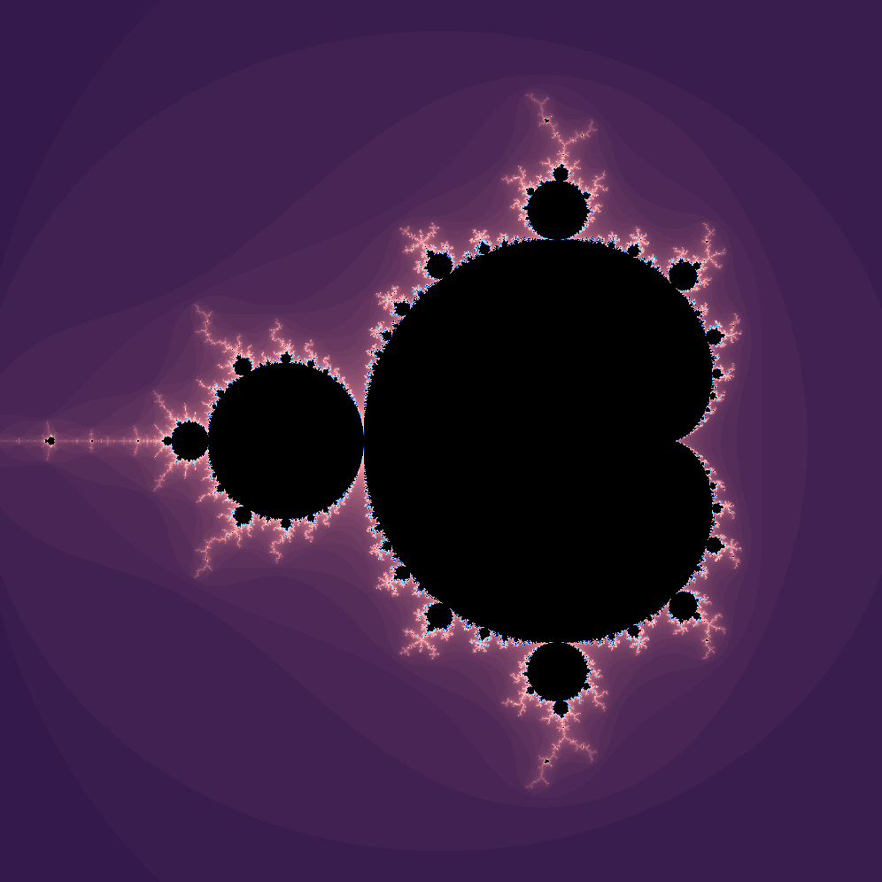

Mandelbrot
==========

Mandelbrot set visual representation with Raylib and GLSL fragment shader.

Quick Start
-----------

	$ ./build.sh
	$ ./mandelbrot

Controls
--------

* `h` or `Arrow Left` - move left
* `j` or `Arrow Down` - move down
* `k` or `Arrow Up` - move up
* `l` or `Arrow Right` - move right
* `w` - zoom in
* `s` - zoom out
* `e` - increase the number of max iterations
* `q` - decrease the number of max iterations
* `r` - reset all the parameters to their defaults (zooming level, max iterations, position)
